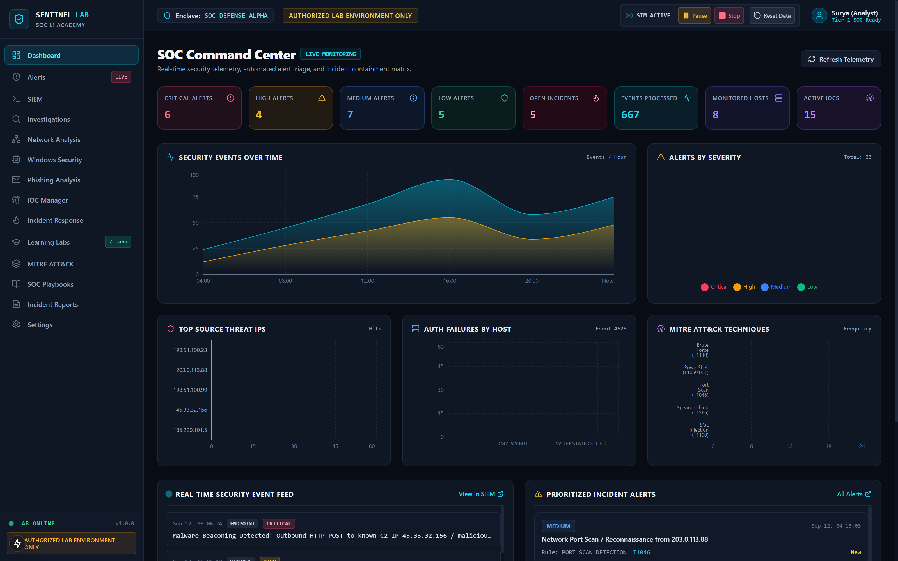
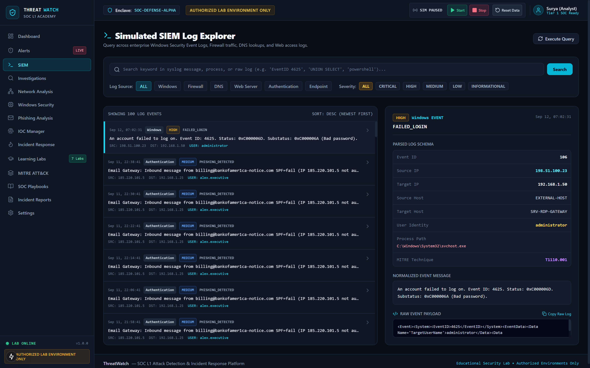
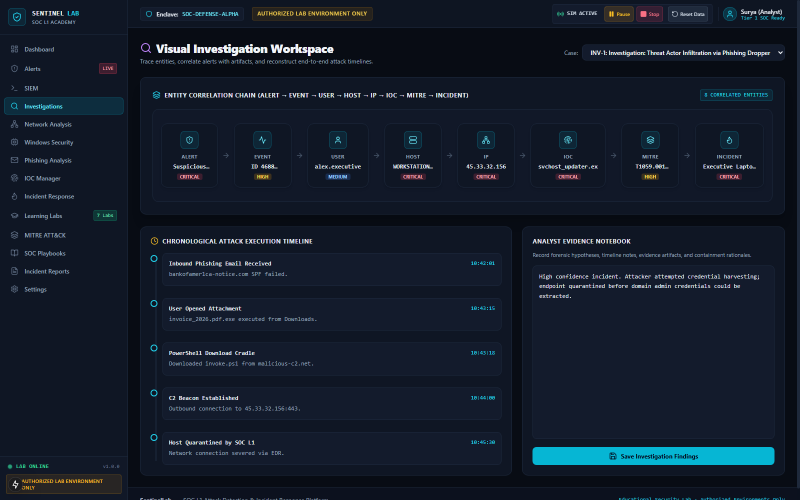
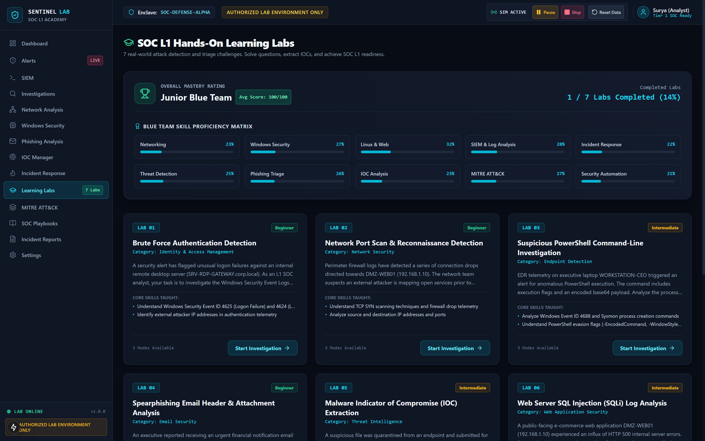
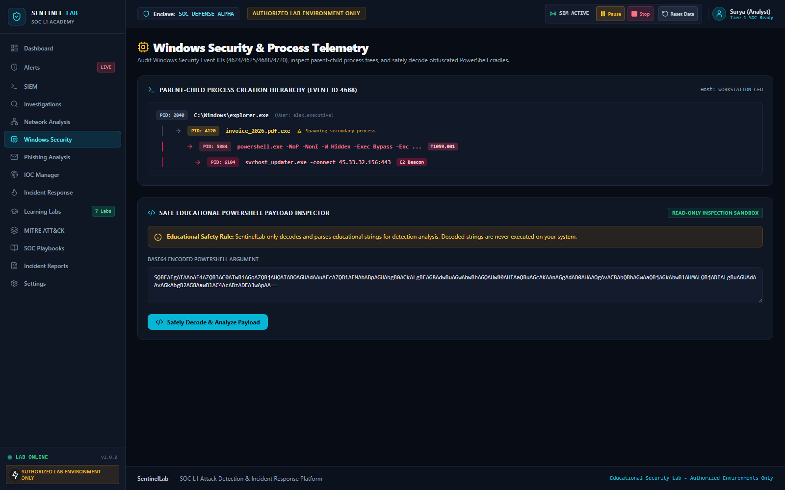
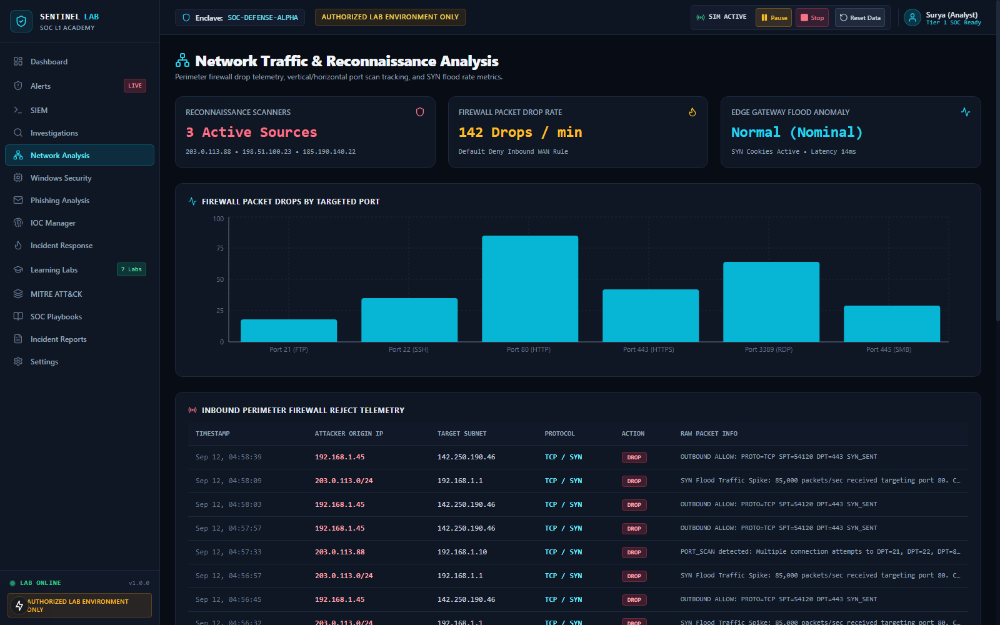

# SentinelLab — SOC L1 Attack Detection & Incident Response Platform

[](LICENSE)
[](https://nextjs.org/)
[](https://fastapi.tiangolo.com/)
[](https://www.python.org/)
[](https://www.typescriptlang.org/)
[](https://attack.mitre.org/)
[](#safety-notice)

> ### ⚠️ SAFETY NOTICE: AUTHORIZED LAB ENVIRONMENT ONLY
> **SentinelLab is strictly an educational cybersecurity simulation platform.**  
> All simulated attacks (brute force, port scanning, obfuscated PowerShell, spearphishing, malware IOCs, SQL injection, and volumetric DDoS) operate strictly on synthetic logs and isolated localhost mock services. No real malware, credential theft, destructive actions, or external network attacks are ever executed.

---

## 📸 Live Application Screenshots & UI Showcase

The following captures demonstrate SentinelLab actively running within an authorized lab environment:

| SOC Command Center Dashboard | Simulated SIEM Log Explorer |
| :---: | :---: |
|  |  |
| *Real-time metrics, live simulation events, and attack telemetry charts* | *Multi-field search across Windows, Firewall, Syslog & Web logs* |

| Visual Entity Investigation | Hands-On Learning Labs |
| :---: | :---: |
|  |  |
| *Entity correlation chain (Alert → Host → User → IOC), attack timeline & analyst notebook* | *7 hands-on attack scenarios with skill matrix scoring & hints* |

| Windows Security & Process Telemetry | Network Reconnaissance & Port Scan Analysis |
| :---: | :---: |
|  |  |
| *Event ID 4688 process creation tree with read-only educational Base64 inspector* | *Firewall packet drop distributions, targeted port scans, and SYN telemetry* |

| Phishing Email Triage & Header Analyzer | 7-Stage Incident Response Lifecycle |
| :---: | :---: |
|  |  |
| *RFC 822 header auditing, SPF validation check, and double-extension detection* | *NIST SP 800-61 incident lifecycle with simulated containment action triggers* |

*(All high-resolution 1600×1000 screenshots are available in the [`docs/screenshots/`](docs/screenshots/) directory).*

---

## 🎯 What is SentinelLab?

**SentinelLab** is an enterprise-grade, portfolio-ready SOC Tier 1 attack detection and incident response training platform. Built specifically for aspiring security analysts, university students, and blue teamers, it simulates the day-to-day workflow of a Security Operations Center (SOC) within a safe, contained environment.

Instead of passively reading theoretical documentation, students actively investigate synthetic attacks, analyze raw security telemetry, triage detection alerts, extract Threat Intelligence Indicators of Compromise (IOCs), contain compromised assets, and produce professional post-incident debrief reports.

---

## 🌟 Core Features

- 📊 **SOC Command Center Dashboard**: Real-time KPI cards (Total Events, Active Alerts, Critical Incidents, Isolated Hosts, MTTR), alert volume area charts, severity breakdowns, and a live activity feed.
- 🔍 **SIEM Log Explorer**: High-performance querying across Windows Security Event Logs (4624, 4625, 4688, 4720), Linux Syslog, Firewall connection drops, DNS queries, and Web server access logs.
- ⚡ **Automated Detection Engine**: 7 modular defensive detection rules evaluating incoming telemetry against MITRE ATT&CK techniques with automatic alert generation.
- 🚨 **Alert Triage Lifecycle**: Full SOC analyst alert management workflow (`New` → `Investigating` → `Escalated` → `Resolved` → `False Positive`) with analyst notes and incident escalation.
- 🕸️ **Visual Investigation Graph**: Interactive node-link graph correlating `Alert` → `Event` → `User` → `Host` → `IP` → `IOC` → `MITRE Technique` → `Incident` with chronological attack timelines.
- 🛡️ **NIST Incident Response Workflow**: 7-Stage NIST SP 800-61 / SANS incident lifecycle with containment action triggers (Host Isolation, Firewall IP Blocking, Credential Revocation).
- 🧪 **7 Hands-on Learning Labs**: Realistic attack scenarios covering Identity, Network, Endpoint, Email, Threat Intel, Web Application, and Infrastructure security with automated grading (0–100 score).
- 🎓 **3 Adaptive Learning Modes**:
  - **Beginner**: Contextual security explanations alongside each question.
  - **Practice**: Challenge questions with on-demand guided hints.
  - **Assessment**: Timed exam mode without hints; answers and forensic explanations revealed upon submission.
- 📄 **Executive & Technical Report Generator**: Generates formal incident debrief reports complete with executive summaries, root cause analysis, timeline of events, containment evidence, and print/PDF export.
- 📡 **Live Telemetry & WebSocket Simulation**: In-process event generation engine streaming live security events and triggering alerts in real-time.

---

## 🏗️ System Architecture

```
                               ┌────────────────────────────────────────────────────────┐
                               │       SentinelLab — SOC L1 Training Platform           │
                               │       "AUTHORIZED LAB ENVIRONMENT ONLY"                │
                               └────────────────────────────────────────────────────────┘
                                                           │
                  ┌────────────────────────────────────────┴────────────────────────────────────────┐
                  ▼                                                                                 ▼
       ┌───────────────────────────┐                                                     ┌───────────────────────────┐
       │   Frontend (Next.js 15)   │                                                     │   Backend (FastAPI Engine)│
       │   React 18 / TypeScript   │ ◄────────── REST API & WebSockets ────────────────► │   Python 3.11+ / SQLite   │
       │   Tailwind CSS (SOC Dark) │                                                     │   Modular Detection Engine│
       │   Recharts + Lucide Icons │                                                     │   In-Process Live Stream  │
       └───────────────────────────┘                                                     └───────────────────────────┘
                  │                                                                                 │
   ┌──────────────┼───────────────────────────┐                                    ┌────────────────┼───────────────────────────┐
   │              │                           │                                    │                │                           │
   ▼              ▼                           ▼                                    ▼                ▼                           ▼
Command-Center    Interactive Labs           Investigation & Reports             Live SOC Event    IOC & MITRE Knowledge     Incident Response
Dashboard & SIEM  (7 Scenarios, 3 Modes)     (Visual Graph & PDF Export)         Simulator         Base                      (7-Stage Lifecycle)
```

> Detailed architecture, data flow specifications, and database schema are available in [**docs/ARCHITECTURE.md**](docs/ARCHITECTURE.md).

---

## 🛡️ The 7 Interactive Learning Labs

| Lab | Scenario Name | Security Domain | MITRE ATT&CK | Key Learning Outcomes |
| :---: | :--- | :--- | :---: | :--- |
| **01** | **Brute Force Detection** | Identity & Access | `T1110.001` | Analyze Event ID 4625 bursts, calculate failed attempt velocities, distinguish lockout vs compromise. |
| **02** | **Port Scan Reconnaissance** | Network Security | `T1046` | Investigate firewall drops for sequential destination ports (SYN scan), isolate attacker IP, assess open services. |
| **03** | **Suspicious PowerShell** | Endpoint Detection | `T1059.001` | Inspect Event ID 4688 process trees, safely decode Base64 command arguments, spot remote download cradles. |
| **04** | **Phishing Header Analysis** | Email Security | `T1566.001` | Audit RFC 822 email headers, detect SPF validation failures, catch typosquatted domains and `.pdf.exe` tricks. |
| **05** | **Malware IOC Extraction** | Threat Intelligence | `T1071.001` | Extract SHA-256 hashes, C2 beaconing domains, and Windows registry persistence keys into actionable threat intel. |
| **06** | **Web SQL Injection (SQLi)** | Web Application | `T1190` | Review Nginx access logs for `UNION SELECT` probes and SQLMap user agents; design WAF rules and parameterized queries. |
| **07** | **DDoS Volumetric Anomaly** | Infrastructure | `T1498.001` | Analyze packet rate anomalies (85k pps), recognize TCP SYN flood patterns, specify edge SYN cookies and rate limits. |

> Detailed lab briefs, evidence samples, and question walk-throughs are available in [**docs/LABS.md**](docs/LABS.md).

---

## ⚡ Detection Rules Engine

SentinelLab includes 7 modular defensive detection rules correlating telemetry in real-time:

| Rule ID | Rule Name | Severity | MITRE ID | Detection Criteria |
| :--- | :--- | :---: | :---: | :--- |
| `RULE-001` | **Multiple Failed Logins (Brute Force)** | High | `T1110.001` | ≥ 5 Event ID 4625 failures within 60s from the same source IP |
| `RULE-002` | **Port Scanning Reconnaissance** | Medium | `T1046` | ≥ 10 firewall drop events across distinct destination ports in 30s |
| `RULE-003` | **Obfuscated PowerShell Execution** | High | `T1059.001` | Event ID 4688 containing `-EncodedCommand`, `DownloadString`, or `IEX` |
| `RULE-004` | **Phishing Email with Malicious Link** | High | `T1566.001` | Email event with SPF failure or attachment with double extension |
| `RULE-005` | **C2 Beaconing Activity** | Critical | `T1071.001` | Network/DNS queries to known malicious IOC domains or C2 IPs |
| `RULE-006` | **Web SQL Injection Attempt** | High | `T1190` | HTTP request URI containing `' OR 1=1`, `UNION SELECT`, or SQLMap agent |
| `RULE-007` | **Volumetric DDoS / SYN Flood** | Critical | `T1498.001` | Connection request velocity exceeding 500 packets/sec to a single target |

> Complete detection rule specifications, logic triggers, and sample events are documented in [**docs/DETECTION-RULES.md**](docs/DETECTION-RULES.md).

---

## 💻 Tech Stack

- **Frontend**: Next.js 15 (App Router), React 18, TypeScript, Tailwind CSS, Lucide Icons, Recharts.
- **Backend**: FastAPI, Python 3.11+, SQLAlchemy 2.0 ORM, Pydantic v2, WebSockets, Uvicorn.
- **Database**: Zero-configuration SQLite (default: `sentinellab.db`) or PostgreSQL.
- **Testing**: Pytest, HTTPX, Next.js Compiler.

---

## 🚀 Quick Start & Installation

### Prerequisites
- **Node.js**: v18.0 or higher
- **Python**: v3.11 or higher
- **Git**

### 1. Clone the Repository
```bash
git clone https://github.com/suryasrisashank-cyber/sentinellab.git
cd sentinellab
```

### 2. Backend Setup

```bash
cd backend

# Create and activate virtual environment
python -m venv .venv
# On Windows:
.venv\Scripts\activate
# On Linux/macOS:
source .venv/bin/activate

# Install dependencies
pip install -r requirements.txt

# (Optional) Copy environment template
cp .env.example .env

# Run FastAPI backend server
python -m uvicorn app.main:app --host 127.0.0.1 --port 8000 --reload
```
> **Backend runs at**: `http://127.0.0.1:8000`  
> **Interactive API Docs (Swagger UI)**: `http://127.0.0.1:8000/docs`  
> *Note: On first startup, SQLite database `sentinellab.db` is automatically created and seeded with 100+ events, 20+ alerts, 5 incidents, 15+ IOCs, and all 7 learning labs.*

### 3. Frontend Setup

In a new terminal window:

```bash
cd frontend

# Install npm packages
npm install

# (Optional) Copy environment template
cp .env.example .env.local

# Start Next.js development server
npm run dev
```
> **Frontend runs at**: `http://localhost:3000`

---

## ⚙️ Environment Variables

Copy `.env.example` to `.env` in both `backend/` and `frontend/` as needed:

### Backend (`backend/.env.example`)
| Variable | Default | Description |
| :--- | :--- | :--- |
| `ENVIRONMENT` | `development` | Runtime environment (`development`, `production`) |
| `HOST` | `127.0.0.1` | Host address for Uvicorn |
| `PORT` | `8000` | Port for backend server |
| `DATABASE_URL` | `sqlite:///./sentinellab.db` | SQLAlchemy connection string |
| `CORS_ORIGINS` | `http://localhost:3000` | Allowed CORS origins for frontend |
| `LOG_LEVEL` | `INFO` | Python logging verbosity |

### Frontend (`frontend/.env.example`)
| Variable | Default | Description |
| :--- | :--- | :--- |
| `NEXT_PUBLIC_API_URL` | `http://127.0.0.1:8000/api` | Base URL for FastAPI REST endpoints |
| `NEXT_PUBLIC_WS_URL` | `ws://127.0.0.1:8000/ws/simulation` | WebSocket stream endpoint |
| `PORT` | `3000` | Frontend web server port |

---

## 🧪 Automated Testing

Execute the backend automated test suite with pytest:

```bash
cd backend
python -m pytest tests/test_backend.py -v
```

### Verified Test Cases:
- ✅ Database auto-initialization & data seeding integrity
- ✅ REST API health check (`/api/health`)
- ✅ SIEM Event filtering, pagination, and multi-field search
- ✅ Alert triage status transitions and incident escalation
- ✅ Detection Engine execution (Brute force, PowerShell detection)
- ✅ Threat intelligence IOC management CRUD operations
- ✅ Interactive Lab submission and automated grading engine
- ✅ Simulation lifecycle controls (start, stop, step, status)

To verify the frontend build:
```bash
cd frontend
npm run build
```

---

## 💼 Demonstration Guide for Portfolio & Interviews

When presenting SentinelLab to a hiring manager or senior cybersecurity team:

1. **Dashboard Overview (`/dashboard`)**: Present the high-level security metrics, 6 real-time charts, and recent activity feed.
2. **Live Event Simulator**: Click **Start Simulation** in the top navigation bar to showcase the WebSocket live event stream and instant detection alert triggers.
3. **Alert Triage (`/alerts`)**: Inspect a high-severity alert, review its triggering detection rule and MITRE ATT&CK technique, acknowledge it, and escalate it to an Incident.
4. **SIEM Log Investigation (`/siem`)**: Demonstrate multi-field searching, inspect raw syslog formats, and filter by Windows Event ID, Firewall, or Web logs.
5. **Entity Graph Analysis (`/investigations`)**: Walk through the visual relationship graph showing how alerts, hosts, user accounts, and IOCs correlate into an attack path.
6. **Incident Containment (`/incidents`)**: Guide the incident through NIST SP 800-61 stages and trigger simulated containment actions (Host Isolation, Firewall IP Blocking).
7. **Hands-On Lab Solving (`/labs`)**: Solve a scenario (e.g. Lab 1 Brute Force or Lab 3 PowerShell), submit findings, and show the automated grading scorecard and skill radar.
8. **Post-Incident Report (`/reports`)**: Generate a formal debrief report and show the clean print/PDF export.
9. **Environment Reset (`/settings`)**: Demonstrate resetting the lab to a clean default state with one click.

---

## 📚 Documentation Directory

- [**Architecture & System Design**](docs/ARCHITECTURE.md) — Comprehensive technical architecture, database schemas, and data flow.
- [**Security & Educational Policy**](docs/SECURITY.md) — Educational boundaries, synthetic data policy, and vulnerability reporting.
- [**The 7 Hands-on Labs Guide**](docs/LABS.md) — Scenarios, MITRE mappings, evidence logs, questions, and learning takeaways.
- [**Detection Rules Catalog**](docs/DETECTION-RULES.md) — Rule definitions, detection criteria, and example triggers.
- [**Contributing Guidelines**](CONTRIBUTING.md) — Setup instructions for contributors, adding new detection rules and labs.
- [**Changelog**](CHANGELOG.md) — Version release history and updates.

---

## 🤝 Contributing

Contributions are welcome! Please read [**CONTRIBUTING.md**](CONTRIBUTING.md) for details on our code of conduct, development setup, and process for submitting pull requests.

---

## 📄 License

This project is licensed under the MIT License — see the [**LICENSE**](LICENSE) file for details.

---

## 👤 Author

**Surya Sri Sashank**  
- GitHub: [@suryasrisashank-cyber](https://github.com/suryasrisashank-cyber)
- Project Repository: [https://github.com/suryasrisashank-cyber/sentinellab](https://github.com/suryasrisashank-cyber/sentinellab)
