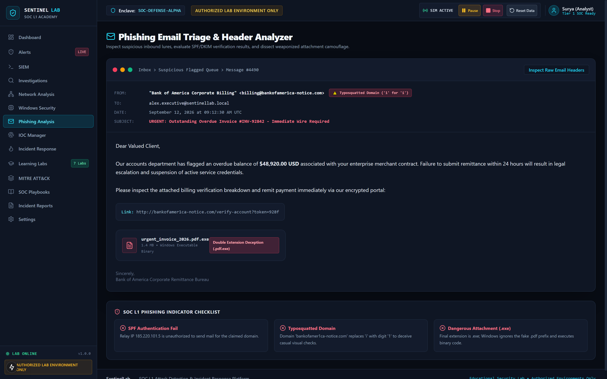

# SentinelLab

## SOC L1 Training & Incident Response Platform

[](LICENSE)
[](https://nextjs.org/)
[](https://fastapi.tiangolo.com/)
[](https://www.python.org/)
[](https://www.typescriptlang.org/)
[](https://attack.mitre.org/)
[](#-safety--authorization)

A safe, synthetic security operations environment for practicing hands-on defensive cybersecurity operations:

**SIEM Investigation • Alert Triage • Threat Detection • IOC Analysis • MITRE ATT&CK • Incident Response**

---

### ⚡ Measurable Project Capabilities

- **7 Interactive SOC Labs**: Hands-on attack investigations covering Identity, Network, Endpoint, Email, Threat Intel, Web Apps, and Infrastructure.
- **7 Detection Rules**: In-memory rule correlation engine evaluating synthetic logs in real time.
- **100+ Synthetic Security Events**: Realistic Windows (4624, 4625, 4688, 4740), Linux Syslog, Perimeter Firewall, DNS, and Web access logs.
- **Automated 0–100 Scoring**: Lab evaluation engine assessing analytical findings with hint penalties and forensic answer explanations.
- **Real-Time Synthetic Event Simulation**: Background event generator streaming live telemetry over WebSockets.
- **IOC Investigation**: Integrated Threat Intelligence repository cataloging malicious IPs, domains, hashes, and files with confidence ratings.
- **MITRE ATT&CK Mapping**: Direct tactical alignment linking telemetry and alerts to ATT&CK Enterprise techniques.
- **Incident Response Workflow**: 7-stage NIST SP 800-61 / SANS response lifecycle with interactive containment triggers.
- **Investigation Timeline**: Chronological entity-correlation graph linking Alert $\rightarrow$ Event $\rightarrow$ User $\rightarrow$ Host $\rightarrow$ IP $\rightarrow$ IOC $\rightarrow$ Incident.
- **Incident Reporting**: Dynamic post-incident debrief report compiler with executive summaries, technical root causes, and PDF/print export.

---

## 🚨 Safety & Authorization

> ### AUTHORIZED LAB ENVIRONMENT ONLY
> **All security events, attacks, IPs, users, hosts, and indicators are synthetic or simulated for educational purposes.**  
> SentinelLab does not perform attacks against real systems. All simulated activity (brute force, port scanning, obfuscated PowerShell, spearphishing, malware IOCs, SQL injection, and volumetric DDoS) executes strictly against synthetic log stores and isolated mock services. Fictional entities and reserved documentation IP ranges (RFC 5737 / RFC 3849) are used throughout.

---

## 🎯 What is SentinelLab?

**SentinelLab** is a portfolio-ready, hands-on SOC L1 training and incident response platform designed to simulate the day-to-day operational workflow of a Security Operations Center analyst.

### Why SentinelLab?
Most cybersecurity portfolio projects present static dashboards with pre-baked charts. SentinelLab was built to demonstrate the **complete operational lifecycle** an analyst performs when triaging security incidents:

1. Ingesting raw multi-source telemetry in a simulated SIEM.
2. Detecting anomalous behavior via custom detection engineering logic.
3. Triaging incoming alerts, distinguishing True Positives from False Positives.
4. Pivoting across correlated entities to construct an attack timeline.
5. Extracting and validating Indicators of Compromise (IOCs).
6. Executing containment procedures (Host Quarantine, IP Blocking, Credential Revocation).
7. Producing formal incident debrief documentation for technical teams and leadership.

---

## ⭐ Key Features

- **SOC Command Center**: Real-time KPI metrics (Critical/High/Medium/Low alerts, open incidents, events processed, MTTR) and dual-area telemetry volume curves.
- **Simulated SIEM Explorer**: Multi-field querying across Windows Event Logs, Linux Syslog, Firewall drops, DNS lookups, and Web access logs with raw payload views.
- **Automated Detection Engine**: 7 modular defensive rules evaluating telemetry against sliding time windows.
- **Alert Triage Lifecycle**: Complete analyst workflow (`New` $\rightarrow$ `Investigating` $\rightarrow$ `Escalated` $\rightarrow$ `Resolved` $\rightarrow$ `False Positive`) with analyst notes.
- **Visual Entity Correlation**: Graph linking `Alert` $\rightarrow$ `Event` $\rightarrow$ `User` $\rightarrow$ `Host` $\rightarrow$ `IP` $\rightarrow$ `IOC` $\rightarrow$ `MITRE` $\rightarrow$ `Incident`.
- **7-Stage Incident Response**: NIST SP 800-61 aligned lifecycle with containment action triggers.
- **3 Adaptive Learning Modes**: Beginner (concept explainers), Practice (guided hints), and Assessment (timed examination).

---

## 🛡️ SOC Skills Demonstrated

### Recruiter Quick View
- **SIEM Investigation**: Querying event logs, filtering by source/severity, and analyzing raw syslog/XML records.
- **Alert Triage**: Assessing alert priority, reviewing triggering rules, and escalating valid threats.
- **Log Analysis**: Deep parsing of Windows Security Event IDs (4624, 4625, 4688, 4740), Linux auth logs, and web logs.
- **Detection Engineering**: Developing sliding-window correlation rules mapped to attack techniques.
- **IOC Analysis**: Extracting, categorizing, and scoring confidence for hashes, IPs, domains, and files.
- **Windows Telemetry Analysis**: Tracing parent-child process creation trees (Sysmon / Event 4688) and inspecting encoded scripts.
- **Phishing Analysis**: Auditing RFC 822 email headers, verifying SPF/DKIM records, and spotting double-extension deception.
- **Network Security Analysis**: Evaluating perimeter firewall reject logs and identifying port scan patterns.
- **MITRE ATT&CK**: Aligning suspicious observations to tactics, techniques, and defensive mitigations.
- **Incident Response**: Guiding incidents through Detection, Triage, Investigation, Containment, Eradication, and Recovery.
- **Security Reporting**: Compiling structured executive summaries, timelines, and post-incident takeaways.

---

## 🧪 7 Interactive SOC Labs

| Lab | Scenario Name | Security Domain | MITRE ID | Key Learning Outcomes |
| :---: | :--- | :--- | :---: | :--- |
| **01** | **Brute Force Detection** | Identity & Access | `T1110.001` | Analyze Event ID 4625 bursts, calculate failed attempt velocities, distinguish lockout vs compromise. |
| **02** | **Port Scan Reconnaissance** | Network Security | `T1046` | Investigate firewall drops for sequential destination ports (SYN scan), isolate attacker IP, assess open services. |
| **03** | **Suspicious PowerShell** | Endpoint Detection | `T1059.001` | Inspect Event ID 4688 process trees, safely inspect Base64 command arguments, spot remote download cradles. |
| **04** | **Phishing Header Analysis** | Email Security | `T1566.001` | Audit RFC 822 email headers, detect SPF validation failures, catch typosquatted domains and `.pdf.exe` tricks. |
| **05** | **Malware IOC Extraction** | Threat Intelligence | `T1071.001` | Extract SHA-256 hashes, C2 beaconing domains, and Windows registry persistence keys into actionable threat intel. |
| **06** | **Web SQL Injection (SQLi)** | Web Application | `T1190` | Review Nginx access logs for `UNION SELECT` probes and SQLMap user agents; design WAF rules and parameterized queries. |
| **07** | **DDoS Volumetric Anomaly** | Infrastructure | `T1498.001` | Analyze packet rate anomalies (85k pps), recognize TCP SYN flood patterns, specify edge SYN cookies and rate limits. |

> Complete scenario briefs, evidence logs, and questions are documented in [**docs/LABS.md**](docs/LABS.md).

---

## 🔎 Detection Rules

SentinelLab incorporates 7 modular defensive detection rules evaluating incoming telemetry:

| Rule ID | Rule Name | Severity | MITRE ID | Detection Criteria |
| :--- | :--- | :---: | :---: | :--- |
| `RULE-AUTH-001` | **Multiple Failed Logins (Brute Force)** | High | `T1110.001` | $\ge 3$ Event ID 4625 failures within 300s from the same source IP |
| `RULE-NET-002` | **Port Scanning Reconnaissance** | Medium | `T1046` | $\ge 4$ firewall drop events across distinct destination ports in 60s |
| `RULE-ENDPOINT-003` | **Obfuscated PowerShell Execution** | High | `T1059.001` | Event ID 4688 containing `-EncodedCommand`, `DownloadString`, or `IEX` |
| `RULE-EMAIL-004` | **Phishing Email with Malicious Link** | High | `T1566.001` | Email event with SPF failure or attachment with double extension |
| `RULE-THREAT-005` | **C2 Beaconing Activity** | Critical | `T1071.001` | Network/DNS queries to known malicious IOC domains or C2 IPs |
| `RULE-WEB-006` | **Web SQL Injection Attempt** | High | `T1190` | HTTP request URI containing `' OR 1=1`, `UNION SELECT`, or SQLMap agent |
| `RULE-INFRA-007` | **Volumetric DDoS / SYN Flood** | Critical | `T1498.001` | Connection request velocity exceeding 500 packets/sec to a single target |

> Rule specifications, evidence requirements, and sample events are documented in [**docs/DETECTION-RULES.md**](docs/DETECTION-RULES.md).

---

## 🔬 Investigation Workflow

SentinelLab models an authentic analytical investigation chain:

```
Telemetry Ingestion (Windows, Syslog, Firewall, DNS, Web)
                        │
                        ▼
             Detection Rule Evaluation
                        │
                        ▼
              Alert Generation & Triage
                        │
                        ▼
           Entity Correlation & Timeline
      (Alert → Event → User → Host → IP → IOC)
                        │
                        ▼
             MITRE ATT&CK Attribution
                        │
                        ▼
             NIST Containment Actions
                        │
                        ▼
            Post-Incident Debrief Report
```

---

## 🧩 MITRE ATT&CK

All simulated attacks, detection rules, and learning labs map to the MITRE ATT&CK Enterprise Matrix:

- **Initial Access**: `T1566.001` (Spearphishing Attachment), `T1566.002` (Spearphishing Link)
- **Execution**: `T1059.001` (PowerShell)
- **Defense Evasion**: `T1027` (Obfuscated Files), `T1036.007` (Double File Extension)
- **Credential Access**: `T1110.001` (Password Guessing)
- **Discovery**: `T1046` (Network Service Discovery)
- **Command & Control**: `T1071.001` (Web Protocols)
- **Impact**: `T1498.001` (Direct Network Flood)

---

## 🚑 Incident Response

SentinelLab implements a 7-stage incident handling lifecycle aligned with **NIST SP 800-61**:

1. **Detection**: Automated rule flags anomaly; alert created.
2. **Triage**: Analyst validates signal, verifies false positive status, assigns severity.
3. **Investigation**: Queries SIEM logs, correlates entity chain, identifies root cause.
4. **Containment**: Executes simulated containment triggers:
   - *Isolate Host*: Quarantines compromised endpoint from subnet.
   - *Block IP*: Injects drop rule at edge firewall gateway.
   - *Reset Credentials*: Invalidates compromised Active Directory accounts.
5. **Eradication**: Removes malicious persistence artifacts and terminates rogue processes.
6. **Recovery**: Restores services from verified clean state, monitoring for re-infection.
7. **Post-Incident / Lessons Learned**: Exports comprehensive debrief documentation.

---

## 🏗️ Architecture

```
User / Analyst
      ↓
Next.js Frontend (React 18, TypeScript, Tailwind CSS, Recharts)
      ↓
FastAPI Backend (Python 3.11+, Uvicorn, Pydantic v2)
      ↓
Detection Engine (7 In-Memory Correlation Rules)
      ↓
Synthetic Security Events (100+ Seeded Events + Live Generator)
      ↓
Alerts / IOC / Investigation (Sliding-Window Correlation)
      ↓
MITRE ATT&CK (Defensive Matrix Alignment)
      ↓
Incident Response (7-Stage NIST SP 800-61 Lifecycle)
      ↓
Incident Report (Markdown / Printable PDF Export)
```

> In-depth architectural data flow, WebSocket protocol, and database schema are detailed in [**docs/ARCHITECTURE.md**](docs/ARCHITECTURE.md).

---

## 🖥️ Screenshots

> Click any screenshot to inspect it in **full 3200×2000 Retina resolution**.

### 1. SOC Command Center Dashboard
[](docs/screenshots/dashboard.png)
*Real-time security telemetry, 8 KPI metric cards (Critical/High/Medium/Low alerts, open incidents, events processed), active simulation status, and attack telemetry curves.*

---

### 2. Simulated SIEM Log Explorer
[](docs/screenshots/siem.png)
*Multi-field search across Windows Event IDs, Firewall connection drops, DNS queries, and Web access logs with parsed schema and raw syslog payload views.*

---

### 3. Visual Entity Investigation Workspace
[](docs/screenshots/investigation.png)
*Interactive entity correlation chain (`Alert` → `Event` → `User` → `Host` → `IP` → `IOC` → `MITRE` → `Incident`), chronological attack timeline, and analyst evidence notebook.*

---

### 4. Phishing Email Triage & Header Analyzer
[](docs/screenshots/phishing.png)
*RFC 822 header auditing, SPF authentication verification, typosquatted domain detection, and `.pdf.exe` double-extension executable camouflage.*

---

### 5. Windows Security & Process Telemetry
[](docs/screenshots/windows-security.png)
*Event ID 4688 parent-child process creation hierarchy (`explorer.exe` → `invoice_2026.pdf.exe` → `powershell.exe`) and read-only educational Base64 PowerShell inspector.*

---

### 6. SOC L1 Hands-On Learning Labs
[](docs/screenshots/labs.png)
*7 hands-on attack scenarios featuring Beginner, Practice, and Assessment modes with automated grading and a 10-domain Blue Team skill proficiency matrix.*

*(Additional high-resolution screenshots are organized in [`docs/screenshots/`](docs/screenshots/)).*

---

## 🎥 Demo

A full 75-second walkthrough demonstrating live telemetry ingestion, alert generation, SIEM exploration, entity correlation, containment execution, and incident report generation:

> **Video Location**: `docs/demo/sentinellab-demo.mp4` *(Upload your recorded MP4 to this path)*

- For step-by-step recording instructions, see [**docs/demo/README.md**](docs/demo/README.md).
- For the second-by-second presentation timeline, see [**docs/demo/DEMO-SCRIPT.md**](docs/demo/DEMO-SCRIPT.md).

---

## 🧰 Tech Stack

- **Frontend**: Next.js 15 (App Router), React 18, TypeScript, Tailwind CSS, Lucide Icons, Recharts.
- **Backend**: FastAPI, Python 3.11+, SQLAlchemy 2.0 ORM, Pydantic v2, WebSockets, Uvicorn.
- **Database**: Zero-configuration SQLite (default: `sentinellab.db`) or PostgreSQL.
- **Testing**: Pytest, HTTPX, Next.js Compiler.

---

## 📊 Testing

Run the automated backend test suite:

```bash
cd backend
python -m pytest tests/test_backend.py -v
```

### Verified Test Suite (8/8 Passing):
- ✅ Database auto-initialization & data seeding integrity
- ✅ REST API health check (`/api/health`)
- ✅ SIEM Event filtering, pagination, and multi-field search
- ✅ Alert triage status transitions and incident escalation
- ✅ Detection Engine execution (Brute force, PowerShell detection)
- ✅ Threat intelligence IOC management CRUD operations
- ✅ Interactive Lab submission and automated grading engine
- ✅ Simulation lifecycle controls (start, stop, step, status)

To verify the frontend production build:
```bash
cd frontend
npm run build
```

---

## 🚀 Installation

### Prerequisites
- **Node.js**: v18.0 or higher
- **Python**: v3.11 or higher
- **Git**

### 1. Clone Repository
```bash
git clone https://github.com/suryasrisashank-cyber/sentinellab.git
cd sentinellab
```

### 2. Backend Setup (Local Development Example)
```bash
cd backend

# Create and activate virtual environment
python -m venv .venv
# On Windows: .venv\Scripts\activate
# On Linux/macOS: source .venv/bin/activate

# Install dependencies
pip install -r requirements.txt

# Start backend server (Runs locally on http://127.0.0.1:8000)
python -m uvicorn app.main:app --host 127.0.0.1 --port 8000 --reload
```
> *API Interactive Documentation (Swagger UI): `http://127.0.0.1:8000/docs`*

### 3. Frontend Setup (Local Development Example)
In a separate terminal window:
```bash
cd frontend

# Install dependencies
npm install

# Start development client (Runs locally on http://localhost:3000)
npm run dev
```

---

## 📁 Project Structure

```
sentinellab/
├── .gitignore                   # Multi-tier ignore rules (builds, databases, secrets)
├── .env.example                 # Global environment template (placeholders only)
├── LICENSE                      # MIT Open Source License with Educational Safety Notice
├── README.md                    # Root documentation and recruiter showcase
├── CONTRIBUTING.md               # Contributor guidelines
├── CHANGELOG.md                  # Release version history
│
├── docs/
│   ├── ARCHITECTURE.md          # Technical specifications, API routes & DB schema
│   ├── SECURITY.md              # Educational boundaries & vulnerability reporting
│   ├── LABS.md                  # 7 hands-on learning labs reference guide
│   ├── DETECTION-RULES.md       # Rule definitions & detection criteria
│   ├── case-studies/            # Detailed SOC investigation case studies
│   │   ├── 01-brute-force-investigation.md
│   │   ├── 02-suspicious-powershell.md
│   │   └── 03-phishing-malware-ioc.md
│   ├── demo/                    # Walkthrough video recording resources
│   │   ├── README.md            # Recording setup guide
│   │   └── DEMO-SCRIPT.md       # 75-second timeline script
│   └── screenshots/             # 3200×2000 Retina screenshots
│
├── backend/                     # FastAPI engine, detection rules, seed, models, tests
└── frontend/                    # Next.js 15 App Router pages, components, API client
```

---

## 📚 Case Studies

Detailed SOC investigation reports detailing incident discovery, forensic triage, and mitigation:

1. [**Case Study 01: Targeted RDP Brute Force Attempt**](docs/case-studies/01-brute-force-investigation.md) — Multi-stage investigation of Windows Event ID 4625 bursts, lockout thresholds, and edge firewall shunning.
2. [**Case Study 02: Obfuscated PowerShell Dropper Investigation**](docs/case-studies/02-suspicious-powershell.md) — Tracing Event ID 4688 parent-child process relationships, safe Base64 decoding, download cradle analysis, and endpoint quarantine.
3. [**Case Study 03: Spearphishing Email & Malware IOC Triage**](docs/case-studies/03-phishing-malware-ioc.md) — Inbound lure analysis, RFC 822 header auditing, SPF authentication failures, double-extension deception, and threat intelligence IOC cataloging.

---

## 🔐 Security

SentinelLab is strictly an educational tool designed for blue team defensive instruction. See [**docs/SECURITY.md**](docs/SECURITY.md) for our educational boundary policies and responsible vulnerability reporting.

---

## 🤝 Contributing

Contributions of new detection rules and educational lab scenarios are welcome. Please see [**CONTRIBUTING.md**](CONTRIBUTING.md) for guidelines.

---

## 📄 License

Licensed under the [MIT License](LICENSE) with an explicit Educational Lab Safety Disclaimer.

---

## 👨‍💻 Author

**Surya Sri Sashank**  
- GitHub: [@suryasrisashank-cyber](https://github.com/suryasrisashank-cyber)  
- Project Repository: [https://github.com/suryasrisashank-cyber/sentinellab](https://github.com/suryasrisashank-cyber/sentinellab)
