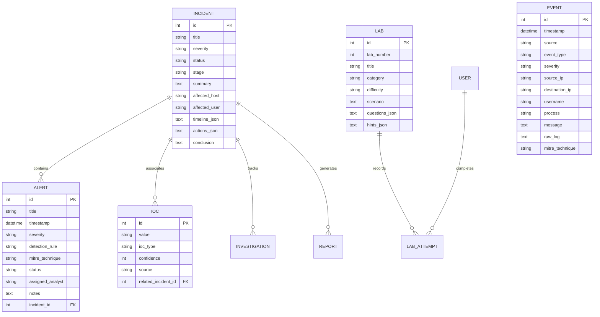

# ThreatWatch — System Architecture & Design Specification

> **NOTICE: AUTHORIZED LAB ENVIRONMENT ONLY**  
> All components described herein operate on synthetic security logs and safe, isolated localhost educational datasets.

---

## 1. High-Level Architecture

ThreatWatch is built on a decoupled, production-style client-server architecture designed to simulate enterprise SOC operations:

```
┌────────────────────────────────────────────────────────────────────────────────────────┐
│                                    FRONTEND LAYER                                      │
│  Next.js 15 (App Router) • React 18 • TypeScript • Tailwind CSS • Recharts • Lucide   │
│  Routes: /dashboard, /alerts, /siem, /investigations, /incidents, /labs, /reports...   │
└───────────────────────────────────────────┬────────────────────────────────────────────┘
                                            │
                             HTTP / REST    │    WebSockets (/ws/simulation)
                             JSON Payloads  │    Bidirectional Telemetry Stream
                                            │
┌───────────────────────────────────────────┴────────────────────────────────────────────┐
│                                    BACKEND ENGINE                                      │
│  FastAPI (Python 3.11+) • Uvicorn ASGI Server • Pydantic v2 • Asyncio Simulation Loop  │
│                                                                                        │
│  ┌───────────────────────┐  ┌───────────────────────┐  ┌────────────────────────────┐  │
│  │  REST API Endpoints   │  │   Detection Engine    │  │  Simulation & WS Service   │  │
│  │  /api/events, alerts, │  │   7 Modular Defensive │  │  Synthetic event pipeline  │  │
│  │  incidents, labs...   │  │   correlation rules   │  │  with live broadcast       │  │
│  └───────────────────────┘  └───────────────────────┘  └────────────────────────────┘  │
└───────────────────────────────────────────┬────────────────────────────────────────────┘
                                            │
                               SQLAlchemy 2.0 ORM Layer
                               Thread-Safe Connection Pool
                                            │
┌───────────────────────────────────────────┴────────────────────────────────────────────┐
│                                    DATABASE LAYER                                      │
│  Zero-Config SQLite (Default: sentinellab.db) • PostgreSQL Compatible via DATABASE_URL │
│  Entities: Events, Alerts, Incidents, Investigations, IOCs, Labs, Playbooks, Reports   │
└────────────────────────────────────────────────────────────────────────────────────────┘
```

---

## 2. Frontend Architecture (`/frontend`)

The frontend is constructed using **Next.js 15 App Router** with modern React server/client component separation:

### Key Directories
- `src/app/`: File-system routed pages matching standard SOC command-center workflows:
  - `/dashboard`: High-level metrics, 6 real-time charts, live security activity feed.
  - `/alerts`: Triage table with multi-status filtering (`New`, `Investigating`, `Escalated`, `Resolved`, `False Positive`) and analyst review drawer.
  - `/siem`: High-performance log explorer with keyword searching and raw syslog payload views.
  - `/investigations`: Node-link entity correlation graph and chronological attack timeline.
  - `/network`: Firewall reject telemetry and sequential port scan analysis.
  - `/windows`: Windows Event IDs (4624/4625/4688) process hierarchy and safe PowerShell inspector.
  - `/phishing`: Mock email client with header parser, SPF/DKIM verification, and typosquatting checker.
  - `/iocs`: Threat Intelligence IOC manager with confidence ratings and CRUD actions.
  - `/incidents`: 7-Stage NIST SP 800-61 incident response lifecycle with containment simulation triggers.
  - `/labs` & `/labs/[id]`: Interactive learning lab runner with 3 modes (**Beginner**, **Practice**, **Assessment**).
  - `/mitre`: MITRE ATT&CK defensive matrix navigator.
  - `/playbooks`: Step-by-step Standard Operating Procedures (SOPs) for blue teamers.
  - `/reports`: Executive & Technical Incident Report Generator with Markdown and printable PDF output.
  - `/settings`: Simulation velocity configuration, single-event injection, and database re-seed controls.
- `src/components/`: Reusable navigation components (`Sidebar.tsx`, `Navbar.tsx`) displaying the persistent **"● LAB ONLINE"** and **"AUTHORIZED LAB ENVIRONMENT ONLY"** badges.
- `src/lib/api.ts`: Centralized, environment-aware API client that handles dynamic host resolution (`localhost` vs local LAN Wi-Fi IP) and transparently falls back from WebSockets to REST polling if disconnected.

---

## 3. Backend Architecture (`/backend`)

The backend is engineered with **FastAPI** to deliver asynchronous performance, strict schema validation, and automatic OpenAPI/Swagger generation:

### Core Modules
- `app/main.py`: Application factory, CORS middleware configuration, DB lifespan manager, and API router aggregation.
- `app/api/`: Decoupled route handlers for health checks, security events, alert triage, incident response, IOC tracking, lab evaluation, and simulation controls.
- `app/services/detection_engine.py`: Event correlation rule engine that consumes synthetic logs and outputs structured alert candidates.
- `app/services/simulation_service.py`: Asynchronous background task generating realistic traffic pulses and streaming updates via WebSockets.
- `app/services/lab_service.py`: Automated grading service that evaluates question submissions, computes scores (0–100), calculates hint penalties, and assigns skill proficiency tiers.
- `app/services/report_service.py`: Incident synthesis engine transforming stored incident records into cohesive technical reports.
- `app/websocket/manager.py`: Client connection manager maintaining active subscriber pools and broadcasting telemetry events.

---

## 4. Database Schema & Entity Relationships

The database layer utilizes **SQLAlchemy 2.0** with explicit foreign keys and relationship cascades:



---

## 5. Detection Engine Architecture

The detection engine uses a modular rule pattern. Each rule inherits from `DetectionRule`:

```python
class DetectionRule:
    def __init__(self, rule_id, name, description, severity, mitre_technique, evidence_requirements):
        ...
    def evaluate(self, current_event: dict, event_history: list[dict]) -> Optional[dict]:
        ...
```

When an event arrives:
1. It is ingested into the database.
2. The recent 20-event sliding window is retrieved.
3. Every registered detection rule evaluates the event against the window.
4. If a threshold is satisfied (e.g. $\ge 3$ failed logins within 5 minutes), a prioritized `Alert` is created and mapped to MITRE ATT&CK.
5. The alert is broadcast over WebSockets to immediately refresh the SOC dashboard without a full page reload.

---

## 6. Live Simulation & WebSockets

1. **Start**: The `SimulationService` spins up an `asyncio.create_task` event loop.
2. **Pulse**: Every $N$ seconds (determined by difficulty: Beginner = 6.0s, Intermediate = 3.5s, Advanced = 1.8s), a synthetic event is drawn from the realistic scenario pool.
3. **Evaluation**: The event runs through the Detection Engine.
4. **Broadcast**: Structured JSON is pushed to all connected clients at `/ws/simulation`:
   ```json
   {
     "type": "security_event",
     "event": { "id": 106, "source": "Windows", "event_type": "FAILED_LOGIN", "severity": "HIGH" },
     "alerts": [...],
     "simulation_status": { "is_running": true, "difficulty": "BEGINNER" }
   }
   ```
5. **Fallback**: If WebSockets are unavailable or blocked by network proxies, the frontend automatically falls back to lightweight REST polling every 5 seconds.
